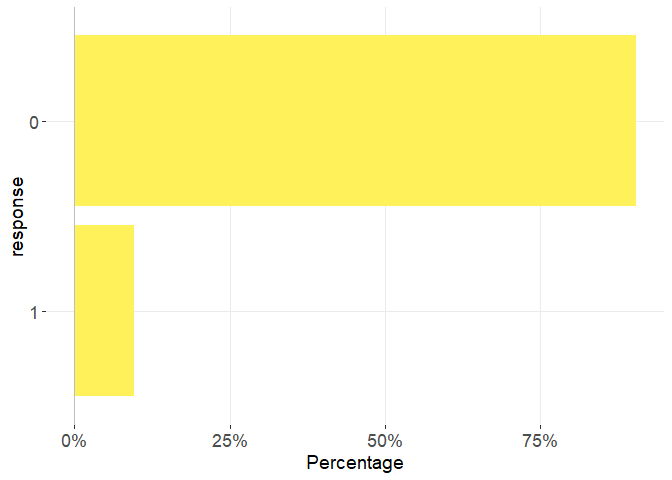
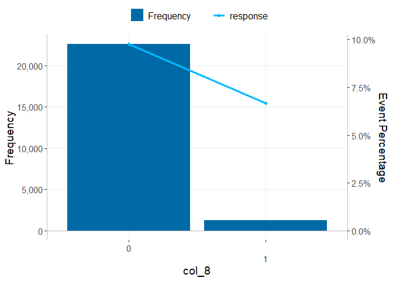
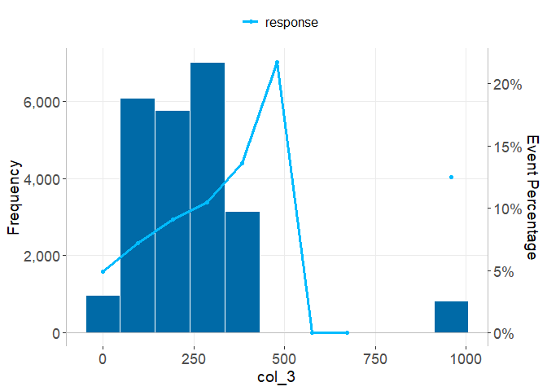
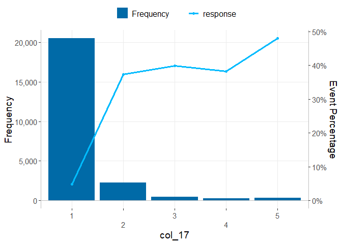
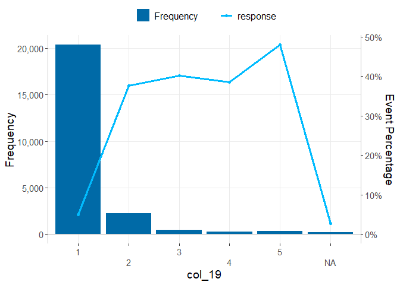
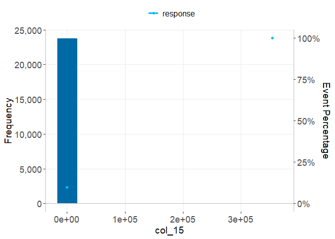
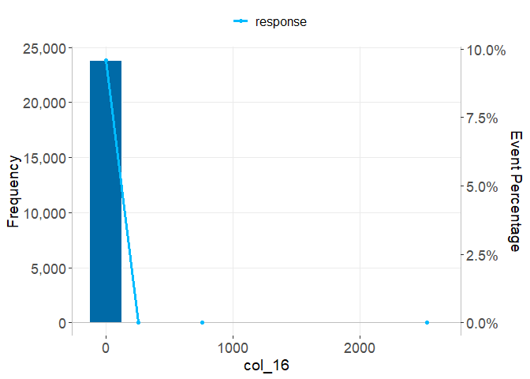
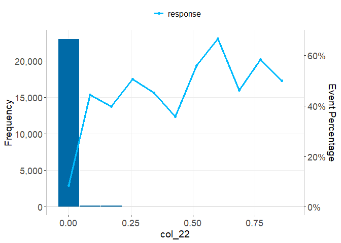

# Cooperative Learning
Leandro Kovalevski

- [Executive summary](#executive-summary)
- [Settings](#settings)
- [1. Dataset description](#dataset-description)
- [2. Exploratory Data Analysis](#exploratory-data-analysis)
  - [2.1. General descriptive analysis](#general-descriptive-analysis)
  - [2.2. Response descriptive analysis](#response-descriptive-analysis)
  - [2.3. Descriptive analysis of categorical
    predictors](#descriptive-analysis-of-categorical-predictors)
  - [2.4. Descriptive analysis of quantitative
    predictors](#descriptive-analysis-of-quantitative-predictors)
  - [2.5. Matrix correlation of quantitative
    predictors](#matrix-correlation-of-quantitative-predictors)
- [3. Model Training](#model-training)
  - [3.1. Data preparation](#data-preparation)
  - [3.2. Stepwise Logistic Regression](#stepwise-logistic-regression)
  - [3.3. Random Forest](#random-forest)
  - [3.4. Cooperative Learning Models](#cooperative-learning-models)
- [4. Models Comparison](#models-comparison)

# Executive summary

- A database of a random sample of 23,857 tax identification numbers
  (CUITs) is analyzed. Past financial behavior is used to predict
  default. The percent of default in the dataset is 9.6%.
- Variable distributions and associations with the response are
  summarized.
- There is a clear (marginal) association between default and some
  variables (‘col_3’, ‘col_2’, ‘col_6’, ‘col_8’, ‘col_17’, ‘col_20’,
  ‘col_21’, ‘col_22’, ‘col_2’ and ‘col_26’) )
- The dataset was divided in training and testing sets in a 70-30 ratio.
- The Cooperative Learning model performance was compared with a
  Stepwise Logistic Regression model performance and a Random Forest
  model performance according to RMSE, AUC, and Lift 5%. Also a
  Accuracy, Recall, Precision and F1 Score were calculate for all models
  using the proportion of events in the training set as the probability
  threshold
- Different Cooperative Learning models were fitted varying the penalty
  parameter $\rho$.
- The best performance of Cooperative Learning models was using a value
  of $\rho$ equal to 0.7, but Stepwise Logistic Regression outperformed
  all models on RMSE, AUC, and Lift 5%.

# Settings

<details>
<summary>Show the code</summary>

``` r
#' Load data and needed packages.

#' Install (if needed)  'here' package to use relative paths. 
if(!("here" %in% installed.packages()[, "Package"])){ 
  install.packages("here") 
  }

#' Load generic functions ----
source(here::here("src", "utils.R"), encoding = "UTF-8")

#' Cargar las librerías necesarias
loadPackages(c(
  # Data Preparation
  "here"
  , "dplyr"
  # Stats & Metrics
  , "pROC"
  , "Metrics"
  ,"gains"
  , "ROCR"
  , "skimr"
  , "scales"
  , "doBy"
  , "moments"
  # Machine Learning
  , "randomForest"
  , "multiview"
  # Visualization
  , "ggplot2"
  , "corrplot"
  , "knitr"
  , "broom"
  ))

#' Set data path
file_path <- here::here("data", "ready")

#' Set models path
models_path <- here::here("results", "models")


#' Set data file names
if( !exists("file_name") ){
  file_name <- "df_bcra.rds"
}

#' Data group (or views) name
group_file_name <- "groups.csv"

#' Read dataset
df <- readRDS(file.path(file_path, file_name))

#' Read dataset
groups <- read.csv2(file.path(file_path, group_file_name))

#' Define the response
response <- "response"
```

</details>

# 1. Dataset description

The database consists of a random sample of 23,857 tax identification
numbers (CUITs) belonging to individuals who had at least one debt in
the Argentine financial system in June 2019, and were in credit
situation 1 or 2 (meaning they did not have overdue payments exceeding
90 days), obtained from the debtor database provided by the Central Bank
of the Argentine Republic (BCRA) for the period of June 2019. For the
tax identification numbers in the random sample, debts in all entities
were recorded and summarized for June 2019, as well as for the previous
6 months. Debts of these tax identification numbers between July 2019
and June 2020 were also recorded to assess their evolution. The response
variable is a binary variable constructed from the most severe credit
situation of the tax identification number (CUIT) between the periods of
July 2019 and June 2020. The variable takes the value 1 if the most
severe credit situation is greater than or equal to 3 in any debt any
period, and 0 otherwise. In the dataset ‘df_bcra.rds’, the information
recorded with 28 variables is available. The data is anonymized and
variable names are not displayed.

# 2. Exploratory Data Analysis

## 2.1. General descriptive analysis

<details>
<summary>Show the code</summary>

``` r
skim(df)
```

</details>

|                                                  |       |
|:-------------------------------------------------|:------|
| Name                                             | df    |
| Number of rows                                   | 23857 |
| Number of columns                                | 28    |
| \_\_\_\_\_\_\_\_\_\_\_\_\_\_\_\_\_\_\_\_\_\_\_   |       |
| Column type frequency:                           |       |
| character                                        | 1     |
| factor                                           | 5     |
| numeric                                          | 22    |
| \_\_\_\_\_\_\_\_\_\_\_\_\_\_\_\_\_\_\_\_\_\_\_\_ |       |
| Group variables                                  | None  |

Data summary

**Variable type: character**

| skim_variable | n_missing | complete_rate | min | max | empty | n_unique | whitespace |
|:--------------|----------:|--------------:|----:|----:|------:|---------:|-----------:|
| col_1         |         0 |             1 |   2 |   2 |     0 |        4 |          0 |

**Variable type: factor**

| skim_variable | n_missing | complete_rate | ordered | n_unique | top_counts                        |
|:--------------|----------:|--------------:|:--------|---------:|:----------------------------------|
| col_6         |         0 |          1.00 | FALSE   |        2 | 1: 22744, 2: 1113, 3: 0, 4: 0     |
| col_8         |         0 |          1.00 | FALSE   |        2 | 0: 22582, 1: 1275                 |
| col_17        |         0 |          1.00 | FALSE   |        5 | 1: 20544, 2: 2281, 3: 434, 5: 331 |
| col_18        |     22369 |          0.06 | FALSE   |        5 | 1: 1397, 2: 82, 3: 6, 4: 2        |
| col_19        |       224 |          0.99 | FALSE   |        5 | 1: 20382, 2: 2225, 3: 430, 5: 331 |

**Variable type: numeric**

| skim_variable | n_missing | complete_rate |     mean |      sd |  p0 |     p25 |      p50 |      p75 |      p100 | hist  |
|:--------------|----------:|--------------:|---------:|--------:|----:|--------:|---------:|---------:|----------:|:------|
| col_2         |         0 |             1 |     1.72 |    1.06 |   1 |    1.00 |     1.00 |     2.00 |     10.00 | ▇▂▁▁▁ |
| col_3         |         0 |             1 |   239.83 |  167.09 |   0 |  130.00 |   228.00 |   308.00 |    959.00 | ▆▇▁▁▁ |
| col_4         |         0 |             1 |   126.25 | 4589.79 |   1 |   11.00 |    31.00 |    83.00 | 707012.00 | ▇▁▁▁▁ |
| col_5         |         0 |             1 |    29.42 |  299.40 |   0 |    0.00 |     0.00 |     0.00 |  15335.00 | ▇▁▁▁▁ |
| col_7         |         0 |             1 |     0.04 |    0.18 |   0 |    0.00 |     0.00 |     0.00 |      1.00 | ▇▁▁▁▁ |
| col_9         |         0 |             1 |     0.05 |    0.21 |   0 |    0.00 |     0.00 |     0.00 |      1.00 | ▇▁▁▁▁ |
| col_10        |         0 |             1 |     6.47 |    1.15 |   1 |    6.00 |     7.00 |     7.00 |      7.00 | ▁▁▁▁▇ |
| col_11        |         0 |             1 |   107.60 | 2311.59 |   1 |   13.00 |    32.14 |    81.29 | 353507.00 | ▇▁▁▁▁ |
| col_12        |         0 |             1 |   105.07 | 2309.24 |   0 |   12.33 |    31.29 |    79.43 | 353507.00 | ▇▁▁▁▁ |
| col_13        |         0 |             1 |     1.96 |   69.89 |   0 |    0.00 |     0.00 |     0.00 |  10609.00 | ▇▁▁▁▁ |
| col_14        |         0 |             1 |    21.99 |  241.68 |   0 |    0.00 |     0.00 |     0.00 |  13519.71 | ▇▁▁▁▁ |
| col_15        |         0 |             1 |    85.60 | 2296.18 |   0 |   12.00 |    29.71 |    72.43 | 353507.00 | ▇▁▁▁▁ |
| col_16        |         0 |             1 |     0.56 |   17.78 |   0 |    0.00 |     0.00 |     0.00 |   2532.14 | ▇▁▁▁▁ |
| col_20        |         0 |             1 |     0.97 |    0.10 |   0 |    1.00 |     1.00 |     1.00 |      1.00 | ▁▁▁▁▇ |
| col_21        |         0 |             1 |     0.02 |    0.07 |   0 |    0.00 |     0.00 |     0.00 |      1.00 | ▇▁▁▁▁ |
| col_22        |         0 |             1 |     0.01 |    0.05 |   0 |    0.00 |     0.00 |     0.00 |      0.86 | ▇▁▁▁▁ |
| col_23        |         0 |             1 |     0.04 |    0.17 |   0 |    0.00 |     0.00 |     0.00 |      1.00 | ▇▁▁▁▁ |
| col_24        |         0 |             1 |     0.05 |    0.21 |   0 |    0.00 |     0.00 |     0.00 |      1.00 | ▇▁▁▁▁ |
| col_25        |         0 |             1 |     0.05 |    0.15 |   0 |    0.00 |     0.00 |     0.00 |      1.00 | ▇▁▁▁▁ |
| col_26        |         0 |             1 |     0.02 |    0.10 |   0 |    0.00 |     0.00 |     0.00 |      0.86 | ▇▁▁▁▁ |
| response      |         0 |             1 |     0.10 |    0.29 |   0 |    0.00 |     0.00 |     0.00 |      1.00 | ▇▁▁▁▁ |
| id            |         0 |             1 | 11929.00 | 6887.07 |   1 | 5965.00 | 11929.00 | 17893.00 |  23857.00 | ▇▇▇▇▇ |

## 2.2. Response descriptive analysis

To analyze the default, we use the variable: **‘response’**, which take
the following values:

- **0**: if the most severe credit situation is always less than 3
  (always the payment delay is less than 90 days).
- **1**: if the most severe credit situation is greater than or equal to
  3 in any debt any period.

<details>
<summary>Show the code</summary>

``` r
cat(paste0("\n### Response variabe: **", response, "**.\n"))
```

</details>

### Response variabe: **response**.

<details>
<summary>Show the code</summary>

``` r
describeCategorical(
  data         = df,
  var          = response,
  bar_color    = "#fff159",
  sec          = "2.2"
  ) 
```

</details>

Analyzing the most frequent values of ‘response’ reveals that 21569
(90.4%) of records have ‘response’ equal to ‘*0*’, while 9.6% have
‘response’ equal to ‘*1*’ (Table 2.2.1).

### Table 2.2.1. Count and percentage of records by ‘response’.

| response | Count records | Percentage |
|:---------|--------------:|-----------:|
| 0        |         21569 |      90.4% |
| 1        |          2288 |       9.6% |

    Warning: Using `size` aesthetic for lines was deprecated in ggplot2 3.4.0.
    ℹ Please use `linewidth` instead.

### Figure 2.2.1. Percentage of records by response.



<details>
<summary>Show the code</summary>

``` r
cat("\n")
```

</details>
<details>
<summary>Show the code</summary>

``` r
cat("\n")
```

</details>

## 2.3. Descriptive analysis of categorical predictors

<details>
<summary>Show the code</summary>

``` r
#' Identify categorical and quantitavie variables
nvars <- names(df)[(sapply(X = df, FUN = class)) %in% 
                     c("integer", "numeric", "double") ]
cvars <- names(df)[(sapply(X = df, FUN = class)) %in% 
                     c("character", "factor", "logical", "text") ]

#' Delete unuseful variables
vars_to_exclude <- c( response, "id" )
nvars              <- nvars[!nvars %in% vars_to_exclude]


for (var in cvars){
  
  describeCategoricalAndBinary(
    data    = df, 
    var     = var, 
    binary  = response,
    ti      = which(cvars == var), 
    gi      = which(cvars == var),
    sec     = "2.3"
    )
}
```

</details>

### Variable: **col_1**.

Analyzing the most frequent values of ‘col_1’ reveals that 10774 (45.2%)
of records have ‘col_1’ equal to ‘*20*’, while 45.0% have ‘col_1’ equal
to ‘*27*’, and 9.4% have ‘col_1’ equal to ‘*23*’ (Table 2.3.1).

**The highest percentage of ‘response’ is for ‘*20*’ with: 9.7%**. The
next highest percentage is for: ‘*27*’, with: 9.6% (Table 2.3.1).

### Table 2.3.1. Count (and percentage) of rds and proportion of events for ‘response’ by ‘col_1’.

| col_1 | n (percentage %) | response |
|:------|-----------------:|---------:|
| 20    |    10774 (45.2%) |    0.097 |
| 23    |      2234 (9.4%) |    0.093 |
| 24    |       116 (0.5%) |    0.034 |
| 27    |    10733 (45.0%) |    0.096 |

    Warning: The `size` argument of `element_line()` is deprecated as of ggplot2 3.4.0.
    ℹ Please use the `linewidth` argument instead.

### Figure 2.3.1. Percentage of rds by col_1.


### Variable: **col_6**.

Analyzing the most frequent values of ‘col_6’ reveals that 22744 (95.3%)
of records have ‘col_6’ equal to ‘*1*’, while 4.7% have ‘col_6’ equal to
‘*2*’ (Table 2.3.2).

**The highest percentage of ‘response’ is for ‘*2*’ with: 59.7%**. The
next highest percentage is for: ‘*1*’, with: 7.1% (Table 2.3.2).

### Table 2.3.2. Count (and percentage) of rds and proportion of events for ‘response’ by ‘col_6’.

| col_6 | n (percentage %) | response |
|:------|-----------------:|---------:|
| 1     |    22744 (95.3%) |    0.071 |
| 2     |      1113 (4.7%) |    0.597 |

### Figure 2.3.2. Percentage of rds by col_6.


### Variable: **col_8**.

Analyzing the most frequent values of ‘col_8’ reveals that 22582 (94.7%)
of records have ‘col_8’ equal to ‘*0*’, while 5.3% have ‘col_8’ equal to
‘*1*’ (Table 2.3.3).

**The highest percentage of ‘response’ is for ‘*0*’ with: 9.8%**. The
next highest percentage is for: ‘*1*’, with: 6.7% (Table 2.3.3).

### Table 2.3.3. Count (and percentage) of rds and proportion of events for ‘response’ by ‘col_8’.

| col_8 | n (percentage %) | response |
|:------|-----------------:|---------:|
| 0     |    22582 (94.7%) |    0.098 |
| 1     |      1275 (5.3%) |    0.067 |

### Figure 2.3.3. Percentage of rds by col_8.



### Variable: **col_17**.

Analyzing the most frequent values of ‘col_17’ reveals that 20544
(86.1%) of records have ‘col_17’ equal to ‘*1*’, while 9.6% have
‘col_17’ equal to ‘*2*’, and 1.8% have ‘col_17’ equal to ‘*3*’ (Table
2.3.4).

**The highest percentage of ‘response’ is for ‘*5*’ with: 48.0%**. The
next highest percentage is for: ‘*3*’, with: 39.9% (Table 2.3.4).

### Table 2.3.4. Count (and percentage) of rds and proportion of events for ‘response’ by ‘col_17’.

| col_17 | n (percentage %) | response |
|:-------|-----------------:|---------:|
| 1      |    20544 (86.1%) |    0.049 |
| 2      |      2281 (9.6%) |    0.373 |
| 3      |       434 (1.8%) |    0.399 |
| 4      |       267 (1.1%) |    0.382 |
| 5      |       331 (1.4%) |    0.480 |

### Figure 2.3.4. Percentage of rds by col_17.


### Variable: **col_18**.

Analyzing the most frequent values of ‘col_18’ reveals that 22369
(93.8%) of records have ‘col_18’ equal to ‘*NA*’, while 5.9% have
‘col_18’ equal to ‘*1*’, and 0.3% have ‘col_18’ equal to ‘*2*’ (Table
2.3.5).

**The highest percentage of ‘response’ is for ‘*2*’ with: 34.1%**. The
next highest percentage is for: ‘*3*’, with: 16.7% (Table 2.3.5).

### Table 2.3.5. Count (and percentage) of rds and proportion of events for ‘response’ by ‘col_18’.

| col_18 | n (percentage %) | response |
|:-------|-----------------:|---------:|
| 1      |      1397 (5.9%) |    0.047 |
| 2      |        82 (0.3%) |    0.341 |
| 3      |         6 (0.0%) |    0.167 |
| 4      |         2 (0.0%) |    0.000 |
| 5      |         1 (0.0%) |    0.000 |
| NA     |    22369 (93.8%) |    0.098 |

### Figure 2.3.5. Percentage of rds by col_18.


### Variable: **col_19**.

Analyzing the most frequent values of ‘col_19’ reveals that 20382
(85.4%) of records have ‘col_19’ equal to ‘*1*’, while 9.3% have
‘col_19’ equal to ‘*2*’, and 1.8% have ‘col_19’ equal to ‘*3*’ (Table
2.3.6).

**The highest percentage of ‘response’ is for ‘*5*’ with: 48.0%**. The
next highest percentage is for: ‘*3*’, with: 40.2% (Table 2.3.6).

### Table 2.3.6. Count (and percentage) of rds and proportion of events for ‘response’ by ‘col_19’.

| col_19 | n (percentage %) | response |
|:-------|-----------------:|---------:|
| 1      |    20382 (85.4%) |    0.050 |
| 2      |      2225 (9.3%) |    0.377 |
| 3      |       430 (1.8%) |    0.402 |
| 4      |       265 (1.1%) |    0.385 |
| 5      |       331 (1.4%) |    0.480 |
| NA     |       224 (0.9%) |    0.027 |

### Figure 2.3.6. Percentage of rds by col_19.


## 2.4. Descriptive analysis of quantitative predictors

<details>
<summary>Show the code</summary>

``` r
for (var in nvars){

  describeNumericAndBinaryResponse(
    data   = df, 
    var    = var, 
    binary = response,
    ti     = which(nvars == var), 
    gi     = which(nvars == var),
    sec    = "2.4" 
    )
}
```

</details>

### Variable: **col_2**.

**The highest percentage of ‘response’ occurs in the interval of
‘col_2’: ‘*9.45 - 10.35*’, with: 57.1%**. The next highest percentage is
in the interval: ‘*7.65 - 8.55*’, with: 31.6% (Table 2.4.1).

### Table 2.4.1. Count (and percentage) of rds and proportion of events for ‘responseaccording to different intervals of ’col_2’.

| col_2        | n (percentage %) | response |
|:-------------|-----------------:|---------:|
| 0.45 - 1.35  |    13476 (56.5%) |    0.074 |
| 1.35 - 2.25  |     6178 (25.9%) |    0.105 |
| 2.25 - 3.15  |     2619 (11.0%) |    0.132 |
| 3.15 - 4.05  |       980 (4.1%) |    0.168 |
| 4.05 - 4.95  |         0 (0.0%) |       NA |
| 4.95 - 5.85  |       377 (1.6%) |    0.212 |
| 5.85 - 6.75  |       131 (0.5%) |    0.206 |
| 6.75 - 7.65  |        59 (0.2%) |    0.220 |
| 7.65 - 8.55  |        19 (0.1%) |    0.316 |
| 8.55 - 9.45  |        11 (0.0%) |    0.273 |
| 9.45 - 10.35 |         7 (0.0%) |    0.571 |

### Figure 2.4.1. Percentage of ‘response’ according to ‘col_2’ intervals.

    Warning: Removed 1 row containing missing values or values outside the scale range
    (`geom_point()`).


### Variable: **col_3**.

**The highest percentage of ‘response’ occurs in the interval of
‘col_3’: ‘*431.55 - 527.45*’, with: 21.7%**. The next highest percentage
is in the interval: ‘*335.65 - 431.55*’, with: 13.6% (Table 2.4.2).

### Table 2.4.2. Count (and percentage) of rds and proportion of events for ‘responseaccording to different intervals of ’col_3’.

| col_3            | n (percentage %) | response |
|:-----------------|-----------------:|---------:|
| -47.95 - 47.95   |       969 (4.1%) |    0.050 |
| 47.95 - 143.85   |     6087 (25.5%) |    0.072 |
| 143.85 - 239.75  |     5770 (24.2%) |    0.091 |
| 239.75 - 335.65  |     7012 (29.4%) |    0.105 |
| 335.65 - 431.55  |     3155 (13.2%) |    0.136 |
| 431.55 - 527.45  |        23 (0.1%) |    0.217 |
| 527.45 - 623.35  |         2 (0.0%) |    0.000 |
| 623.35 - 719.25  |         1 (0.0%) |    0.000 |
| 719.25 - 815.15  |         0 (0.0%) |       NA |
| 815.15 - 911.05  |         0 (0.0%) |       NA |
| 911.05 - 1006.95 |       838 (3.5%) |    0.125 |

### Figure 2.4.2. Percentage of ‘response’ according to ‘col_3’ intervals.

    Warning: Removed 2 rows containing missing values or values outside the scale range
    (`geom_point()`).



### Variable: **col_4**.

**The highest percentage of ‘response’ occurs in the interval of
‘col_4’: ‘*671660.45 - 742361.55*’, with: 100.0%**. The next highest
percentage is in the interval: ‘*-35350.55 - 35350.55*’, with: 9.6%
(Table 2.4.3).

### Table 2.4.3. Count (and percentage) of rds and proportion of events for ‘responseaccording to different intervals of ’col_4’.

| col_4                 | n (percentage %) | response |
|:----------------------|-----------------:|---------:|
| -35350.55 - 35350.55  |   23856 (100.0%) |    0.096 |
| 35350.55 - 106051.65  |         0 (0.0%) |       NA |
| 106051.65 - 176752.75 |         0 (0.0%) |       NA |
| 176752.75 - 247453.85 |         0 (0.0%) |       NA |
| 247453.85 - 318154.95 |         0 (0.0%) |       NA |
| 318154.95 - 388856.05 |         0 (0.0%) |       NA |
| 388856.05 - 459557.15 |         0 (0.0%) |       NA |
| 459557.15 - 530258.25 |         0 (0.0%) |       NA |
| 530258.25 - 600959.35 |         0 (0.0%) |       NA |
| 600959.35 - 671660.45 |         0 (0.0%) |       NA |
| 671660.45 - 742361.55 |         1 (0.0%) |    1.000 |

### Figure 2.4.3. Percentage of ‘response’ according to ‘col_4’ intervals.

    Warning: Removed 9 rows containing missing values or values outside the scale range
    (`geom_point()`).


### Variable: **col_5**.

**The highest percentage of ‘response’ occurs in the interval of
‘col_5’: ‘*14568.25 - 16101.75*’, with: 100.0%**. The next highest
percentage is in the interval: ‘*-766.75 - 766.75*’, with: 9.6% (Table
2.4.4).

### Table 2.4.4. Count (and percentage) of rds and proportion of events for ‘responseaccording to different intervals of ’col_5’.

| col_5               | n (percentage %) | response |
|:--------------------|-----------------:|---------:|
| -766.75 - 766.75    |    23633 (99.1%) |    0.096 |
| 766.75 - 2300.25    |       143 (0.6%) |    0.035 |
| 2300.25 - 3833.75   |        44 (0.2%) |    0.068 |
| 3833.75 - 5367.25   |        25 (0.1%) |    0.040 |
| 5367.25 - 6900.75   |         3 (0.0%) |    0.000 |
| 6900.75 - 8434.25   |         5 (0.0%) |    0.000 |
| 8434.25 - 9967.75   |         1 (0.0%) |    0.000 |
| 9967.75 - 11501.25  |         2 (0.0%) |    0.000 |
| 11501.25 - 13034.75 |         0 (0.0%) |       NA |
| 13034.75 - 14568.25 |         0 (0.0%) |       NA |
| 14568.25 - 16101.75 |         1 (0.0%) |    1.000 |

### Figure 2.4.4. Percentage of ‘response’ according to ‘col_5’ intervals.

    Warning: Removed 2 rows containing missing values or values outside the scale range
    (`geom_point()`).



### Variable: **col_7**.

**The highest percentage of ‘response’ occurs in the interval of
‘col_7’: ‘*0.05 - 0.15*’, with: 15.2%**. The next highest percentage is
in the interval: ‘*0.25 - 0.35*’, with: 14.0% (Table 2.4.5).

### Table 2.4.5. Count (and percentage) of rds and proportion of events for ‘responseaccording to different intervals of ’col_7’.

| col_7        | n (percentage %) | response |
|:-------------|-----------------:|---------:|
| -0.05 - 0.05 |    22593 (94.7%) |    0.098 |
| 0.05 - 0.15  |        46 (0.2%) |    0.152 |
| 0.15 - 0.25  |        53 (0.2%) |    0.132 |
| 0.25 - 0.35  |        43 (0.2%) |    0.140 |
| 0.35 - 0.45  |        66 (0.3%) |    0.106 |
| 0.45 - 0.55  |        63 (0.3%) |    0.016 |
| 0.55 - 0.65  |        70 (0.3%) |    0.057 |
| 0.65 - 0.75  |       105 (0.4%) |    0.104 |
| 0.75 - 0.85  |        95 (0.4%) |    0.074 |
| 0.85 - 0.95  |       177 (0.7%) |    0.056 |
| 0.95 - 1.05  |       546 (2.3%) |    0.046 |

### Figure 2.4.5. Percentage of ‘response’ according to ‘col_7’ intervals.


### Variable: **col_9**.

**The highest percentage of ‘response’ occurs in the interval of
‘col_9’: ‘*0.95 - 1.05*’, with: 59.7%**. The next highest percentage is
in the interval: ‘*-0.05 - 0.05*’, with: 7.1% (Table 2.4.6).

### Table 2.4.6. Count (and percentage) of rds and proportion of events for ‘responseaccording to different intervals of ’col_9’.

| col_9        | n (percentage %) | response |
|:-------------|-----------------:|---------:|
| -0.05 - 0.05 |    22744 (95.3%) |    0.071 |
| 0.05 - 0.15  |         0 (0.0%) |       NA |
| 0.15 - 0.25  |         0 (0.0%) |       NA |
| 0.25 - 0.35  |         0 (0.0%) |       NA |
| 0.35 - 0.45  |         0 (0.0%) |       NA |
| 0.45 - 0.55  |         0 (0.0%) |       NA |
| 0.55 - 0.65  |         0 (0.0%) |       NA |
| 0.65 - 0.75  |         0 (0.0%) |       NA |
| 0.75 - 0.85  |         0 (0.0%) |       NA |
| 0.85 - 0.95  |         0 (0.0%) |       NA |
| 0.95 - 1.05  |      1113 (4.7%) |    0.597 |

### Figure 2.4.6. Percentage of ‘response’ according to ‘col_9’ intervals.

    Warning: Removed 9 rows containing missing values or values outside the scale range
    (`geom_point()`).



### Variable: **col_10**.

**The highest percentage of ‘response’ occurs in the interval of
‘col_10’: ‘*2.7 - 3.3*’, with: 15.3%**. The next highest percentage is
in the interval: ‘*0.9 - 1.5*’, with: 11.8% (Table 2.4.7).

### Table 2.4.7. Count (and percentage) of rds and proportion of events for ‘responseaccording to different intervals of ’col_10’.

| col_10    | n (percentage %) | response |
|:----------|-----------------:|---------:|
| 0.9 - 1.5 |       211 (0.9%) |    0.118 |
| 1.5 - 2.1 |       545 (2.3%) |    0.097 |
| 2.1 - 2.7 |         0 (0.0%) |       NA |
| 2.7 - 3.3 |       359 (1.5%) |    0.153 |
| 3.3 - 3.9 |         0 (0.0%) |       NA |
| 3.9 - 4.5 |       423 (1.8%) |    0.097 |
| 4.5 - 5.1 |       754 (3.2%) |    0.102 |
| 5.1 - 5.7 |         0 (0.0%) |       NA |
| 5.7 - 6.3 |     4468 (18.7%) |    0.071 |
| 6.3 - 6.9 |         0 (0.0%) |       NA |
| 6.9 - 7.5 |    17097 (71.7%) |    0.101 |

### Figure 2.4.7. Percentage of ‘response’ according to ‘col_10’ intervals.

    Warning: Removed 4 rows containing missing values or values outside the scale range
    (`geom_point()`).


### Variable: **col_11**.

**The highest percentage of ‘response’ occurs in the interval of
‘col_11’: ‘*335830.7 - 371181.3*’, with: 100.0%**. The next highest
percentage is in the interval: ‘*-17675.3 - 17675.3*’, with: 9.6% (Table
2.4.8).

### Table 2.4.8. Count (and percentage) of rds and proportion of events for ‘responseaccording to different intervals of ’col_11’.

| col_11              | n (percentage %) | response |
|:--------------------|-----------------:|---------:|
| -17675.3 - 17675.3  |   23856 (100.0%) |    0.096 |
| 17675.3 - 53025.9   |         0 (0.0%) |       NA |
| 53025.9 - 88376.5   |         0 (0.0%) |       NA |
| 88376.5 - 123727.1  |         0 (0.0%) |       NA |
| 123727.1 - 159077.7 |         0 (0.0%) |       NA |
| 159077.7 - 194428.3 |         0 (0.0%) |       NA |
| 194428.3 - 229778.9 |         0 (0.0%) |       NA |
| 229778.9 - 265129.5 |         0 (0.0%) |       NA |
| 265129.5 - 300480.1 |         0 (0.0%) |       NA |
| 300480.1 - 335830.7 |         0 (0.0%) |       NA |
| 335830.7 - 371181.3 |         1 (0.0%) |    1.000 |

### Figure 2.4.8. Percentage of ‘response’ according to ‘col_11’ intervals.

    Warning: Removed 9 rows containing missing values or values outside the scale range
    (`geom_point()`).


### Variable: **col_12**.

**The highest percentage of ‘response’ occurs in the interval of
‘col_12’: ‘*335831.65 - 371182.35*’, with: 100.0%**. The next highest
percentage is in the interval: ‘*-17675.35 - 17675.35*’, with: 9.6%
(Table 2.4.9).

### Table 2.4.9. Count (and percentage) of rds and proportion of events for ‘responseaccording to different intervals of ’col_12’.

| col_12                | n (percentage %) | response |
|:----------------------|-----------------:|---------:|
| -17675.35 - 17675.35  |   23856 (100.0%) |    0.096 |
| 17675.35 - 53026.05   |         0 (0.0%) |       NA |
| 53026.05 - 88376.75   |         0 (0.0%) |       NA |
| 88376.75 - 123727.45  |         0 (0.0%) |       NA |
| 123727.45 - 159078.15 |         0 (0.0%) |       NA |
| 159078.15 - 194428.85 |         0 (0.0%) |       NA |
| 194428.85 - 229779.55 |         0 (0.0%) |       NA |
| 229779.55 - 265130.25 |         0 (0.0%) |       NA |
| 265130.25 - 300480.95 |         0 (0.0%) |       NA |
| 300480.95 - 335831.65 |         0 (0.0%) |       NA |
| 335831.65 - 371182.35 |         1 (0.0%) |    1.000 |

### Figure 2.4.9. Percentage of ‘response’ according to ‘col_12’ intervals.

    Warning: Removed 9 rows containing missing values or values outside the scale range
    (`geom_point()`).


### Variable: **col_13**.

**The highest percentage of ‘response’ occurs in the interval of
‘col_13’: ‘*10078.55 - 11139.45*’, with: 100.0%**. The next highest
percentage is in the interval: ‘*530.45 - 1591.35*’, with: 66.7% (Table
2.4.10).

### Table 2.4.10. Count (and percentage) of rds and proportion of events for ‘responseaccording to different intervals of ’col_13’.

| col_13              | n (percentage %) | response |
|:--------------------|-----------------:|---------:|
| -530.45 - 530.45    |   23853 (100.0%) |    0.096 |
| 530.45 - 1591.35    |         3 (0.0%) |    0.667 |
| 1591.35 - 2652.25   |         0 (0.0%) |       NA |
| 2652.25 - 3713.15   |         0 (0.0%) |       NA |
| 3713.15 - 4774.05   |         0 (0.0%) |       NA |
| 4774.05 - 5834.95   |         0 (0.0%) |       NA |
| 5834.95 - 6895.85   |         0 (0.0%) |       NA |
| 6895.85 - 7956.75   |         0 (0.0%) |       NA |
| 7956.75 - 9017.65   |         0 (0.0%) |       NA |
| 9017.65 - 10078.55  |         0 (0.0%) |       NA |
| 10078.55 - 11139.45 |         1 (0.0%) |    1.000 |

### Figure 2.4.10. Percentage of ‘response’ according to ‘col_13’ intervals.

    Warning: Removed 8 rows containing missing values or values outside the scale range
    (`geom_point()`).


### Variable: **col_14**.

**The highest percentage of ‘response’ occurs in the interval of
‘col_14’: ‘*12843.7285714286 - 14195.7*’, with: 100.0%**. The next
highest percentage is in the interval: ‘*-675.985714285714 -
675.985714285714*’, with: 9.6% (Table 2.4.11).

### Table 2.4.11. Count (and percentage) of rds and proportion of events for ‘responseaccording to different intervals of ’col_14’.

| col_14                               | n (percentage %) | response |
|:-------------------------------------|-----------------:|---------:|
| -675.985714285714 - 675.985714285714 |    23688 (99.3%) |    0.096 |
| 675.985714285714 - 2027.95714285714  |       112 (0.5%) |    0.045 |
| 2027.95714285714 - 3379.92857142857  |        34 (0.1%) |    0.029 |
| 3379.92857142857 - 4731.9            |        10 (0.0%) |    0.000 |
| 4731.9 - 6083.87142857143            |         6 (0.0%) |    0.000 |
| 6083.87142857143 - 7435.84285714286  |         1 (0.0%) |    0.000 |
| 7435.84285714286 - 8787.81428571428  |         3 (0.0%) |    0.000 |
| 8787.81428571428 - 10139.7857142857  |         1 (0.0%) |    0.000 |
| 10139.7857142857 - 11491.7571428571  |         1 (0.0%) |    0.000 |
| 11491.7571428571 - 12843.7285714286  |         0 (0.0%) |       NA |
| 12843.7285714286 - 14195.7           |         1 (0.0%) |    1.000 |

### Figure 2.4.11. Percentage of ‘response’ according to ‘col_14’ intervals.

    Warning: Removed 1 row containing missing values or values outside the scale range
    (`geom_point()`).


### Variable: **col_15**.

**The highest percentage of ‘response’ occurs in the interval of
‘col_15’: ‘*335831.65 - 371182.35*’, with: 100.0%**. The next highest
percentage is in the interval: ‘*-17675.35 - 17675.35*’, with: 9.6%
(Table 2.4.12).

### Table 2.4.12. Count (and percentage) of rds and proportion of events for ‘responseaccording to different intervals of ’col_15’.

| col_15                | n (percentage %) | response |
|:----------------------|-----------------:|---------:|
| -17675.35 - 17675.35  |   23856 (100.0%) |    0.096 |
| 17675.35 - 53026.05   |         0 (0.0%) |       NA |
| 53026.05 - 88376.75   |         0 (0.0%) |       NA |
| 88376.75 - 123727.45  |         0 (0.0%) |       NA |
| 123727.45 - 159078.15 |         0 (0.0%) |       NA |
| 159078.15 - 194428.85 |         0 (0.0%) |       NA |
| 194428.85 - 229779.55 |         0 (0.0%) |       NA |
| 229779.55 - 265130.25 |         0 (0.0%) |       NA |
| 265130.25 - 300480.95 |         0 (0.0%) |       NA |
| 300480.95 - 335831.65 |         0 (0.0%) |       NA |
| 335831.65 - 371182.35 |         1 (0.0%) |    1.000 |

### Figure 2.4.12. Percentage of ‘response’ according to ‘col_15’ intervals.

    Warning: Removed 9 rows containing missing values or values outside the scale range
    (`geom_point()`).



### Variable: **col_16**.

**The highest percentage of ‘response’ occurs in the interval of
‘col_16’: ‘*-126.607142857143 - 126.607142857143*’, with: 9.6%**. The
next highest percentage is in the interval: ‘*126.607142857143 -
379.821428571429*’, with: 0.0% (Table 2.4.13).

### Table 2.4.13. Count (and percentage) of rds and proportion of events for ‘responseaccording to different intervals of ’col_16’.

| col_16                               | n (percentage %) | response |
|:-------------------------------------|-----------------:|---------:|
| -126.607142857143 - 126.607142857143 |   23850 (100.0%) |    0.096 |
| 126.607142857143 - 379.821428571429  |         5 (0.0%) |    0.000 |
| 379.821428571429 - 633.035714285714  |         0 (0.0%) |       NA |
| 633.035714285714 - 886.25            |         1 (0.0%) |    0.000 |
| 886.25 - 1139.46428571429            |         0 (0.0%) |       NA |
| 1139.46428571429 - 1392.67857142857  |         0 (0.0%) |       NA |
| 1392.67857142857 - 1645.89285714286  |         0 (0.0%) |       NA |
| 1645.89285714286 - 1899.10714285714  |         0 (0.0%) |       NA |
| 1899.10714285714 - 2152.32142857143  |         0 (0.0%) |       NA |
| 2152.32142857143 - 2405.53571428571  |         0 (0.0%) |       NA |
| 2405.53571428571 - 2658.75           |         1 (0.0%) |    0.000 |

### Figure 2.4.13. Percentage of ‘response’ according to ‘col_16’ intervals.

    Warning: Removed 7 rows containing missing values or values outside the scale range
    (`geom_point()`).



### Variable: **col_20**.

**The highest percentage of ‘response’ occurs in the interval of
‘col_20’: ‘*0.05 - 0.15*’, with: 71.4%**. The next highest percentage is
in the interval: ‘*0.35 - 0.45*’, with: 62.7% (Table 2.4.14).

### Table 2.4.14. Count (and percentage) of rds and proportion of events for ‘responseaccording to different intervals of ’col_20’.

| col_20       | n (percentage %) | response |
|:-------------|-----------------:|---------:|
| -0.05 - 0.05 |        27 (0.1%) |    0.593 |
| 0.05 - 0.15  |        14 (0.1%) |    0.714 |
| 0.15 - 0.25  |        31 (0.1%) |    0.613 |
| 0.25 - 0.35  |        70 (0.3%) |    0.414 |
| 0.35 - 0.45  |        67 (0.3%) |    0.627 |
| 0.45 - 0.55  |       116 (0.5%) |    0.530 |
| 0.55 - 0.65  |       160 (0.7%) |    0.531 |
| 0.65 - 0.75  |       400 (1.7%) |    0.452 |
| 0.75 - 0.85  |       522 (2.2%) |    0.433 |
| 0.85 - 0.95  |       946 (4.0%) |    0.369 |
| 0.95 - 1.05  |    21504 (90.1%) |    0.059 |

### Figure 2.4.14. Percentage of ‘response’ according to ‘col_20’ intervals.


### Variable: **col_21**.

**The highest percentage of ‘response’ occurs in the interval of
‘col_21’: ‘*0.85 - 0.95*’, with: 75.0%**. The next highest percentage is
in the interval: ‘*0.55 - 0.65*’, with: 72.7% (Table 2.4.15).

### Table 2.4.15. Count (and percentage) of rds and proportion of events for ‘responseaccording to different intervals of ’col_21’.

| col_21       | n (percentage %) | response |
|:-------------|-----------------:|---------:|
| -0.05 - 0.05 |    21935 (91.9%) |    0.066 |
| 0.05 - 0.15  |       901 (3.8%) |    0.388 |
| 0.15 - 0.25  |       472 (2.0%) |    0.449 |
| 0.25 - 0.35  |       328 (1.4%) |    0.506 |
| 0.35 - 0.45  |        92 (0.4%) |    0.511 |
| 0.45 - 0.55  |        60 (0.3%) |    0.533 |
| 0.55 - 0.65  |        22 (0.1%) |    0.727 |
| 0.65 - 0.75  |        22 (0.1%) |    0.500 |
| 0.75 - 0.85  |         6 (0.0%) |    0.667 |
| 0.85 - 0.95  |         4 (0.0%) |    0.750 |
| 0.95 - 1.05  |        15 (0.1%) |    0.667 |

### Figure 2.4.15. Percentage of ‘response’ according to ‘col_21’ intervals.


### Variable: **col_22**.

**The highest percentage of ‘response’ occurs in the interval of
‘col_22’: ‘*0.557142857142857 - 0.642857142857143*’, with: 66.7%**. The
next highest percentage is in the interval: ‘*0.728571428571429 -
0.814285714285715*’, with: 58.3% (Table 2.4.16).

### Table 2.4.16. Count (and percentage) of rds and proportion of events for ‘responseaccording to different intervals of ’col_22’.

| col_22                                   | n (percentage %) | response |
|:-----------------------------------------|-----------------:|---------:|
| -0.0428571428571429 - 0.0428571428571429 |    23102 (96.8%) |    0.084 |
| 0.0428571428571429 - 0.128571428571429   |       240 (1.0%) |    0.444 |
| 0.128571428571429 - 0.214285714285714    |       210 (0.9%) |    0.398 |
| 0.214285714285714 - 0.3                  |       101 (0.4%) |    0.505 |
| 0.3 - 0.385714285714286                  |        62 (0.3%) |    0.452 |
| 0.385714285714286 - 0.471428571428571    |        42 (0.2%) |    0.357 |
| 0.471428571428571 - 0.557142857142857    |        25 (0.1%) |    0.560 |
| 0.557142857142857 - 0.642857142857143    |        27 (0.1%) |    0.667 |
| 0.642857142857143 - 0.728571428571429    |        26 (0.1%) |    0.462 |
| 0.728571428571429 - 0.814285714285715    |        12 (0.1%) |    0.583 |
| 0.814285714285714 - 0.9                  |        10 (0.0%) |    0.500 |

### Figure 2.4.16. Percentage of ‘response’ according to ‘col_22’ intervals.



### Variable: **col_23**.

**The highest percentage of ‘response’ occurs in the interval of
‘col_23’: ‘*0.25 - 0.35*’, with: 10.4%**. The next highest percentage is
in the interval: ‘*-0.05 - 0.05*’, with: 9.8% (Table 2.4.17).

### Table 2.4.17. Count (and percentage) of rds and proportion of events for ‘responseaccording to different intervals of ’col_23’.

| col_23       | n (percentage %) | response |
|:-------------|-----------------:|---------:|
| -0.05 - 0.05 |    22418 (94.0%) |    0.098 |
| 0.05 - 0.15  |       183 (0.8%) |    0.060 |
| 0.15 - 0.25  |       113 (0.5%) |    0.088 |
| 0.25 - 0.35  |       106 (0.4%) |    0.104 |
| 0.35 - 0.45  |        84 (0.4%) |    0.048 |
| 0.45 - 0.55  |        80 (0.3%) |    0.088 |
| 0.55 - 0.65  |       114 (0.5%) |    0.079 |
| 0.65 - 0.75  |       118 (0.5%) |    0.076 |
| 0.75 - 0.85  |       153 (0.6%) |    0.020 |
| 0.85 - 0.95  |       139 (0.6%) |    0.086 |
| 0.95 - 1.05  |       349 (1.5%) |    0.046 |

### Figure 2.4.17. Percentage of ‘response’ according to ‘col_23’ intervals.


### Variable: **col_24**.

**The highest percentage of ‘response’ occurs in the interval of
‘col_24’: ‘*0.75 - 0.85*’, with: 14.3%**. The next highest percentage is
in the interval: ‘*0.55 - 0.65*’, with: 12.7% (Table 2.4.18).

### Table 2.4.18. Count (and percentage) of rds and proportion of events for ‘responseaccording to different intervals of ’col_24’.

| col_24       | n (percentage %) | response |
|:-------------|-----------------:|---------:|
| -0.05 - 0.05 |    22369 (93.8%) |    0.098 |
| 0.05 - 0.15  |       151 (0.6%) |    0.033 |
| 0.15 - 0.25  |        54 (0.2%) |    0.019 |
| 0.25 - 0.35  |        47 (0.2%) |    0.043 |
| 0.35 - 0.45  |        41 (0.2%) |    0.049 |
| 0.45 - 0.55  |        10 (0.0%) |    0.000 |
| 0.55 - 0.65  |        55 (0.2%) |    0.127 |
| 0.65 - 0.75  |        57 (0.2%) |    0.105 |
| 0.75 - 0.85  |         7 (0.0%) |    0.143 |
| 0.85 - 0.95  |       221 (0.9%) |    0.059 |
| 0.95 - 1.05  |       845 (3.5%) |    0.067 |

### Figure 2.4.18. Percentage of ‘response’ according to ‘col_24’ intervals.


### Variable: **col_25**.

**The highest percentage of ‘response’ occurs in the interval of
‘col_25’: ‘*0.95 - 1.05*’, with: 68.3%**. The next highest percentage is
in the interval: ‘*0.85 - 0.95*’, with: 58.2% (Table 2.4.19).

### Table 2.4.19. Count (and percentage) of rds and proportion of events for ‘responseaccording to different intervals of ’col_25’.

| col_25       | n (percentage %) | response |
|:-------------|-----------------:|---------:|
| -0.05 - 0.05 |    20544 (86.1%) |    0.049 |
| 0.05 - 0.15  |      1084 (4.5%) |    0.278 |
| 0.15 - 0.25  |       257 (1.1%) |    0.346 |
| 0.25 - 0.35  |       695 (2.9%) |    0.401 |
| 0.35 - 0.45  |       434 (1.8%) |    0.429 |
| 0.45 - 0.55  |        80 (0.3%) |    0.475 |
| 0.55 - 0.65  |       298 (1.2%) |    0.500 |
| 0.65 - 0.75  |       209 (0.9%) |    0.426 |
| 0.75 - 0.85  |        28 (0.1%) |    0.536 |
| 0.85 - 0.95  |       165 (0.7%) |    0.582 |
| 0.95 - 1.05  |        63 (0.3%) |    0.683 |

### Figure 2.4.19. Percentage of ‘response’ according to ‘col_25’ intervals.


### Variable: **col_26**.

**The highest percentage of ‘response’ occurs in the interval of
‘col_26’: ‘*0.814285714285714 - 0.9*’, with: 58.7%**. The next highest
percentage is in the interval: ‘*0.557142857142857 -
0.642857142857143*’, with: 47.1% (Table 2.4.20).

### Table 2.4.20. Count (and percentage) of rds and proportion of events for ‘responseaccording to different intervals of ’col_26’.

| col_26                                   | n (percentage %) | response |
|:-----------------------------------------|-----------------:|---------:|
| -0.0428571428571429 - 0.0428571428571429 |    22825 (95.7%) |    0.081 |
| 0.0428571428571429 - 0.128571428571429   |         0 (0.0%) |       NA |
| 0.128571428571429 - 0.214285714285714    |       319 (1.3%) |    0.373 |
| 0.214285714285714 - 0.3                  |       171 (0.7%) |    0.368 |
| 0.3 - 0.385714285714286                  |        31 (0.1%) |    0.355 |
| 0.385714285714286 - 0.471428571428571    |       166 (0.7%) |    0.416 |
| 0.471428571428571 - 0.557142857142857    |        22 (0.1%) |    0.409 |
| 0.557142857142857 - 0.642857142857143    |       119 (0.5%) |    0.471 |
| 0.642857142857143 - 0.728571428571429    |        88 (0.4%) |    0.455 |
| 0.728571428571429 - 0.814285714285715    |         7 (0.0%) |    0.429 |
| 0.814285714285714 - 0.9                  |       109 (0.5%) |    0.587 |

### Figure 2.4.20. Percentage of ‘response’ according to ‘col_26’ intervals.

    Warning: Removed 1 row containing missing values or values outside the scale range
    (`geom_point()`).


## 2.5. Matrix correlation of quantitative predictors

<details>
<summary>Show the code</summary>

``` r
M      <- cor(df[, nvars], use = "pairwise.complete.obs")
df_cor <- cor(df[, nvars])
corrplot(df_cor, order = 'hclust', addrect = 5)
```

</details>


# 3. Model Training

## 3.1. Data preparation

<details>
<summary>Show the code</summary>

``` r
# Convert character variables to factors and then remove unused factor levels
predictors_to_exclude <- c(response, "id", "col_18", "col_19")
cvars  <- cvars[! cvars %in% predictors_to_exclude]

df <- df %>%
  mutate(across(all_of(cvars), ~ if (is.character(.)) as.factor(.) else .)) %>%
  mutate(across(all_of(cvars), droplevels))

# Formula to create dummies
dummy_formula <- formula(paste0(" ~ ", paste(cvars, collapse = " + "), " - 1" ) )

# Convert categorical variables to dummy variables
dummy_vars <- model.matrix(dummy_formula, data = df)

# Split the data into a training set (70%) and a test set (30%)

# Set a seed to reproduce the results
set.seed(2000)

# Sample Indexes
indexes <- sample(1:nrow(df), size = round(0.3 * nrow(df)))

# Split data
df_ready    <- cbind(df[c(response, nvars)], dummy_vars)
df_to_train <- df_ready[-indexes,]
df_to_test  <- df_ready[ indexes,]

# Standardize numeric variables in the train set
numeric_vars_std <- scale(df_to_train[, nvars])

# Save means and standard deviations
df_standardization <- data.frame(
  variable = colnames(numeric_vars_std),
  mean     = attr(numeric_vars_std, "scaled:center"),
  sd       = attr(numeric_vars_std, "scaled:scale")
)
write.csv(df_standardization, file = file.path(file_path, "features_std.csv"),  row.names = FALSE)

# Standardize numeric variables in the test set
numeric_vars_test_std <- scale(df_to_test[, nvars], center = df_standardization$mean, scale = df_standardization$sd)

# Prepare train and test sets with standarized numeric variables
df_train <- cbind(df_to_train[, !colnames(df_to_train) %in% nvars], numeric_vars_std)
df_test  <- cbind(df_to_test[, !colnames(df_to_test) %in% nvars], numeric_vars_test_std)


# Predictors to exclude
predictors  <- colnames(df_train)[! colnames(df_train) %in% predictors_to_exclude]

# Model formula to analyze the renponse variable with all the predictors
model_formula <- formula(paste0(response, " ~ ", paste(predictors, collapse = " + ") ) )


performance_models  <- data.frame()
prop_df_train       <- prop.table(table(df_train[response]))[2]
```

</details>

## 3.2. Stepwise Logistic Regression

A stepwise logistic regression is fitted.

<details>
<summary>Show the code</summary>

``` r
#' Full model
rl_full <- suppressWarnings(glm(model_formula, family = binomial(link = 'logit'), data = df_train))

#' Model with only the intercept
rl_intercepto <- suppressWarnings(glm(response ~ 1, family = binomial(link = 'logit'), data = df_train))

fit_rl <- suppressWarnings(step(
  rl_intercepto, 
  scope = list(lower = rl_intercepto, upper = rl_full), 
  direction = "both",
  trace = 0
) )
cat(paste0("\n### Stepwise Logistic Regression Coefficients.\n"))
```

</details>

### Stepwise Logistic Regression Coefficients.

<details>
<summary>Show the code</summary>

``` r
kable(tidy(fit_rl))
```

</details>

<div class="cell-output-display">

| term        |   estimate | std.error |  statistic |   p.value |
|:------------|-----------:|----------:|-----------:|----------:|
| (Intercept) | -2.9189541 | 0.0404960 | -72.080121 | 0.0000000 |
| col_62      |  1.3362643 | 0.1054282 |  12.674642 | 0.0000000 |
| col_172     |  1.4712505 | 0.0959083 |  15.340181 | 0.0000000 |
| col_3       |  0.1770373 | 0.0264783 |   6.686127 | 0.0000000 |
| col_26      |  0.1364188 | 0.0396999 |   3.436251 | 0.0005898 |
| col_173     |  1.6636511 | 0.1772915 |   9.383705 | 0.0000000 |
| col_2       |  0.2023306 | 0.0277996 |   7.278187 | 0.0000000 |
| col_10      | -0.1649019 | 0.0294972 |  -5.590419 | 0.0000000 |
| col_175     |  1.8858509 | 0.2645310 |   7.129035 | 0.0000000 |
| col_174     |  1.4753011 | 0.2661482 |   5.543156 | 0.0000000 |
| col_23      | -0.1532474 | 0.0387788 |  -3.951832 | 0.0000776 |
| col_21      |  0.1007449 | 0.0264385 |   3.810536 | 0.0001387 |
| col_13      |  0.3185304 | 0.1555422 |   2.047872 | 0.0405726 |
| col_124     | -1.0150503 | 0.6111045 |  -1.661009 | 0.0967116 |

</div>

<details>
<summary>Show the code</summary>

``` r
#' Logistic Regression Metrics
predictions <- predict(fit_rl, df_test, type = "response")

performance_rl <- calculate_metrics(
  name   = "Log Reg",
  y_real = as.numeric(as.character(df_test[[response]])), # it is necessary to convert the factor variable to numeric
  y_prob = predictions,
  cutoff = prop_df_train
)
```

</details>

    Setting levels: control = 0, case = 1

    Setting direction: controls < cases

<details>
<summary>Show the code</summary>

``` r
cat(paste0("\n### Logistic Regression Performance Metrics\n"))
```

</details>

### Logistic Regression Performance Metrics

<details>
<summary>Show the code</summary>

``` r
knitr::kable(performance_rl, digits = 3)
```

</details>

<div class="cell-output-display">

| Model   |  RMSE |      AUC | Lift_5 | Accuracy | Recall | Precision | Specificity | F1_Score |
|:--------|------:|---------:|-------:|---------:|-------:|----------:|------------:|---------:|
| Log Reg | 0.259 | 0.806188 |  6.301 |    0.864 |  0.598 |     0.367 |       0.892 |    0.455 |

</div>

<details>
<summary>Show the code</summary>

``` r
performance_models <- rbind(
  performance_models, 
  performance_rl
)
```

</details>

## 3.3. Random Forest

<details>
<summary>Show the code</summary>

``` r
nt = 500
df_train[[response]] <- as.factor(df_train[[response]])

randomForest <- randomForest(
  model_formula,
  data       = df_train,  
  ntree      = nt,  
  mtry       = 5,    
  importance = TRUE
) 

#' Random Forest metrics
predictions <- predict(randomForest, df_test, type = "prob")[, 2]

performance_rf <- calculate_metrics(
  name   = paste0("Random Forest - ntree ", nt),
  y_real = as.numeric(as.character(df_test[[response]])), 
  y_prob = predictions,
  cutoff = prop_df_train
)
```

</details>

    Setting levels: control = 0, case = 1

    Setting direction: controls < cases

<details>
<summary>Show the code</summary>

``` r
cat(paste0("\n\n### Random Forest Performance Metrics\n\n"))
```

</details>


    ### Random Forest Performance Metrics

<details>
<summary>Show the code</summary>

``` r
knitr::kable(performance_rf, digits = 3)
```

</details>

| Model                     |  RMSE |       AUC | Lift_5 | Accuracy | Recall | Precision | Specificity | F1_Score |
|:--------------------------|------:|----------:|-------:|---------:|-------:|----------:|------------:|---------:|
| Random Forest - ntree 500 | 0.262 | 0.7816235 |  6.124 |    0.862 |  0.586 |      0.36 |       0.891 |    0.446 |

<details>
<summary>Show the code</summary>

``` r
performance_models <- rbind(
  performance_models, 
  performance_rf
)
```

</details>

## 3.4. Cooperative Learning Models

<details>
<summary>Show the code</summary>

``` r
#' ### Split data in the views.
groups <- groups %>%
  mutate(prefix = paste0("g", group))
```

</details>
<details>
<summary>Show the code</summary>

``` r
# Create vector lists of variables that belong to each group 
for (group in unique(groups$prefix)) {
  # Vectors with the features of each group
  assign(group, groups$feature[groups$prefix == group])
  # Data set of each group
  index <- which(group == unique(groups$prefix))
  assign(paste0("x", index), as.matrix(df_train[, get(group)]))
}

for (group in unique(groups$prefix)) {
  # Data set of each group
  index <- which(group == unique(groups$prefix))
  assign(paste0("test_x", index), as.matrix(df_test[, get(group)]))
}
```

</details>

### 3.4.1 Cooperative Learning with penalty parameter ($\rho$) equal to 0.5

<details>
<summary>Show the code</summary>

``` r
#' Create a folder for the model
rho        <- 0.5
n_groups   <- length(unique(groups$prefix))
n_vars     <- sum(table(groups$prefix)) 
model_name <- paste("CoopLearn_", "r", rho, "_g", n_groups, "_p", n_vars, sep = "")

#' Create the folder, if it does not exist
dir.create(file.path(models_path, model_name), showWarnings = FALSE)

#' Define the response
y      <- df_train[, response]
y_test <- df_test[, response]


if (!file.exists(file.path(models_path, model_name, "predictions.csv"))) {
  
  # Fit model
  start_time <- Sys.time()
  fit_coop = cv.multiview(
    list(x1, x2, x3, x4, x5, x6), 
    y, 
    family       = binomial(), 
    type.measure = "deviance", 
    nfolds       = 3,
    rho          = rho,
    trace.it     = TRUE
  )
  
  finish_time <- Sys.time()
  coop_learning_time <- difftime(finish_time, start_time, units = "sec") 
  
  # Lasso penalty parameter
  reg <- fit_coop$lambda.min
  
  #' Calculate predictions
  pred_multiview <- predict(
    fit_coop, 
    newx = list(test_x1, test_x2, test_x3, test_x4, test_x5, test_x6), 
    s = reg, type = "response"
  )
  
  #' Calculate the metrics
  performance_cl01 <- calculate_metrics(
    name   = model_name,
    y_real = y_test, 
    y_prob = as.vector(pred_multiview),
    cutoff = prop_df_train
  )
  
  performance_models <- rbind(
    performance_models, 
    performance_cl01
  )
  
  #' Save the model object
  saveRDS(fit_coop, file = file.path(models_path, model_name, "model_object.rds"))
  #' Save execution time
  write.csv(coop_learning_time, file = file.path(models_path, model_name, "execution_time.csv"))
  #' Save predictions
  df_to_kpis <- data.frame(y_test, pred_multiview)
  write.csv(df_to_kpis, file = file.path(models_path, model_name, "predictions.csv"))
  #' Save kpis
  write.csv(performance_cl01, file = file.path(models_path, model_name, "kpis.csv"))
} else {
  # Read risk, metrics, and importance
  dfPredictions        <- read.csv(file = file.path(models_path, model_name, "predictions.csv")) %>% 
    select(-X)
  kpis                 <- read.csv(file = file.path(models_path, model_name, "kpis.csv"))[, -1]
  fit_coop             <- readRDS(file = file.path(models_path, model_name, "model_object.rds")) 
  coop_learning_time   <- read.csv(file = file.path(models_path, model_name, "execution_time.csv"))[, 2] 
  
  
  performance_models <- rbind(
    performance_models, 
    kpis
  )
  
}

#' #### Model: **`r paste0(model_name)`**.


#' #### Adjusted coefficients
cat(paste0("\n"))
```

</details>
<details>
<summary>Show the code</summary>

``` r
cat(paste0("\n### Coefficients by view\n"))
```

</details>


    ### Coefficients by view

<details>
<summary>Show the code</summary>

``` r
cat(paste0("\n"))
```

</details>
<details>
<summary>Show the code</summary>

``` r
coef(fit_coop, s = "lambda.min")
```

</details>

    31 x 1 sparse Matrix of class "dgCMatrix"
                             s1
    (Intercept)   -2.2696043097
    View1:col_11   0.0263295836
    View1:col_12  -0.0347556375
    View1:col_4    0.0022621861
    View1:col_15   0.0107289484
    View2:col_13   0.0099089231
    View2:col_5    0.0019060819
    View2:col_14  -0.0060963747
    View2:col_7   -0.0011020747
    View2:col_23  -0.0062311867
    View2:col_24   0.0049602479
    View3:col_2    0.0150872761
    View3:col_11  -0.0002934944
    View4:col_16  -0.0008227085
    View4:col_22   0.0021857725
    View4:col_26   0.0330170292
    View5:col_3    0.0049150149
    View5:col_9    0.0310308626
    View5:col_21  -0.0044436390
    View5:col_25   0.0381043718
    View5:col_20  -0.0055248814
    View6:col_120  0.0012922967
    View6:col_123  .           
    View6:col_124 -0.0169444844
    View6:col_127 -0.0008212166
    View6:col_62   0.1630322239
    View6:col_81  -0.0119235582
    View6:col_172  0.0765576868
    View6:col_173  0.1398903648
    View6:col_174  0.1568649608
    View6:col_175  0.1879236273

<details>
<summary>Show the code</summary>

``` r
#' #### Kpis
cat(paste0("\n"))
```

</details>
<details>
<summary>Show the code</summary>

``` r
cat(paste0("\n### Coop Learning Performance Metrics - $$\rho$$ = 0.5\n"))
```

</details>


    ### Coop Learning Performance Metrics - $$
    ho$$ = 0.5

<details>
<summary>Show the code</summary>

``` r
cat(paste0("\n"))
```

</details>
<details>
<summary>Show the code</summary>

``` r
cat(paste0("\n"))
```

</details>
<details>
<summary>Show the code</summary>

``` r
cat(paste0("\n### Coop Learning Performance Metrics - $$\\rho$$ = 0.5\n"))
```

</details>


    ### Coop Learning Performance Metrics - $$\rho$$ = 0.5

<details>
<summary>Show the code</summary>

``` r
cat(paste0("\n"))
```

</details>
<details>
<summary>Show the code</summary>

``` r
cat(paste0("\n"))
```

</details>
<details>
<summary>Show the code</summary>

``` r
cat(paste0("\n### Coop Learning Performance Metrics - $\\rho$ = 0.5\n"))
```

</details>


    ### Coop Learning Performance Metrics - $\rho$ = 0.5

<details>
<summary>Show the code</summary>

``` r
cat(paste0("\n"))
```

</details>
<details>
<summary>Show the code</summary>

``` r
knitr::kable(kpis, digits = 3)
```

</details>

| Model                 |  RMSE |   AUC | Lift_5 | Accuracy | Recall | Precision | Specificity | F1_Score |
|:----------------------|------:|------:|-------:|---------:|-------:|----------:|------------:|---------:|
| CoopLearn_r0.5_g6_p30 | 0.286 | 0.801 |  6.212 |    0.871 |  0.588 |     0.384 |       0.901 |    0.464 |

<details>
<summary>Show the code</summary>

``` r
#'
#'
#' ## CoopLearning - Model 1 rho = 0.7
#' 
#' 

#' Create a folder for the model
rho        <- 0.7
n_groups   <- length(unique(groups$prefix))
n_vars     <- sum(table(groups$prefix)) 
model_name <- paste("CoopLearn_", "r", rho, "_g", n_groups, "_p", n_vars, sep = "")

#' Create the folder, if it does not exist
dir.create(file.path(models_path, model_name), showWarnings = FALSE)

#' Define the response
y      <- df_train[, response]
y_test <- df_test[, response]


if (!file.exists(file.path(models_path, model_name, "predictions.csv"))) {
  
  # Fit model
  start_time <- Sys.time()
  fit_coop = cv.multiview(
    list(x1, x2, x3, x4, x5, x6), 
    y, 
    family       = binomial(), 
    type.measure = "deviance", 
    nfolds       = 3,
    rho          = rho,
    trace.it     = TRUE
  )
  
  finish_time <- Sys.time()
  coop_learning_time <- difftime(finish_time, start_time, units = "sec") 
  
  # Lasso penalty parameter
  reg <- fit_coop$lambda.min
  
  #' Calculate predictions
  pred_multiview <- predict(
    fit_coop, 
    newx = list(test_x1, test_x2, test_x3, test_x4, test_x5, test_x6), 
    s = reg, type = "response"
  )
  
  #' Calculate the metrics
  performance_cl01 <- calculate_metrics(
    name   = model_name,
    y_real = y_test, 
    y_prob = as.vector(pred_multiview),
    cutoff = prop_df_train
  )
  
  performance_models <- rbind(
    performance_models, 
    performance_cl01
  )
  
  #' Save the model object
  saveRDS(fit_coop, file = file.path(models_path, model_name, "model_object.rds"))
  #' Save execution time
  write.csv(coop_learning_time, file = file.path(models_path, model_name, "execution_time.csv"))
  #' Save predictions
  df_to_kpis <- data.frame(y_test, pred_multiview)
  write.csv(df_to_kpis, file = file.path(models_path, model_name, "predictions.csv"))
  #' Save kpis
  write.csv(performance_cl01, file = file.path(models_path, model_name, "kpis.csv"))
} else {
  # Read risk, metrics, and importance
  dfPredictions        <- read.csv(file = file.path(models_path, model_name, "predictions.csv")) %>% 
    select(-X)
  kpis                 <- read.csv(file = file.path(models_path, model_name, "kpis.csv"))[, -1]
  fit_coop             <- readRDS(file = file.path(models_path, model_name, "model_object.rds")) 
  coop_learning_time   <- read.csv(file = file.path(models_path, model_name, "execution_time.csv"))[, 2] 
  
  
  performance_models <- rbind(
    performance_models, 
    kpis
  )
}


#' #### Adjusted coefficients
coef(fit_coop, s = "lambda.min")
```

</details>

    31 x 1 sparse Matrix of class "dgCMatrix"
                             s1
    (Intercept)   -2.259814e+00
    View1:col_11   1.694369e-02
    View1:col_12  -2.593892e-02
    View1:col_4    4.584922e-03
    View1:col_15   7.899764e-03
    View2:col_13   7.606791e-03
    View2:col_5    1.321351e-03
    View2:col_14  -4.402113e-03
    View2:col_7   -6.639034e-04
    View2:col_23  -4.683167e-03
    View2:col_24   3.629822e-03
    View3:col_2    1.108799e-02
    View3:col_11  -4.141176e-05
    View4:col_16  -5.760644e-04
    View4:col_22   1.661771e-03
    View4:col_26   2.492949e-02
    View5:col_3    3.539407e-03
    View5:col_9    2.301464e-02
    View5:col_21  -3.991819e-03
    View5:col_25   2.879402e-02
    View5:col_20  -4.549918e-03
    View6:col_120  9.518635e-04
    View6:col_123  .           
    View6:col_124 -1.216977e-02
    View6:col_127 -5.682295e-04
    View6:col_62   1.216469e-01
    View6:col_81  -8.524972e-03
    View6:col_172  5.603420e-02
    View6:col_173  1.050638e-01
    View6:col_174  1.196430e-01
    View6:col_175  1.426151e-01

<details>
<summary>Show the code</summary>

``` r
#' #### Kpis
cat(paste0("\n"))
```

</details>
<details>
<summary>Show the code</summary>

``` r
cat(paste0("\n### Coop Learning Performance Metrics II\n"))
```

</details>


    ### Coop Learning Performance Metrics II

<details>
<summary>Show the code</summary>

``` r
cat(paste0("\n"))
```

</details>
<details>
<summary>Show the code</summary>

``` r
knitr::kable(kpis, digits = 3)
```

</details>

| Model                 |  RMSE |   AUC | Lift_5 | Accuracy | Recall | Precision | Specificity | F1_Score |
|:----------------------|------:|------:|-------:|---------:|-------:|----------:|------------:|---------:|
| CoopLearn_r0.7_g6_p30 | 0.288 | 0.801 |  6.212 |    0.871 |  0.591 |     0.384 |       0.901 |    0.466 |

<details>
<summary>Show the code</summary>

``` r
#'
#'
#' ## CoopLearning - Model 1 rho = 1
#' 
#' 

#' Create a folder for the model
rho        <- 1
n_groups   <- length(unique(groups$prefix))
n_vars     <- sum(table(groups$prefix)) 
model_name <- paste("CoopLearn_", "r", rho, "_g", n_groups, "_p", n_vars, sep = "")

#' Create the folder, if it does not exist
dir.create(file.path(models_path, model_name), showWarnings = FALSE)

#' Define the response
y      <- df_train[, response]
y_test <- df_test[, response]


if (!file.exists(file.path(models_path, model_name, "predictions.csv"))) {
  
  # Fit model
  start_time <- Sys.time()
  fit_coop = cv.multiview(
    list(x1, x2, x3, x4, x5, x6), 
    y, 
    family       = binomial(), 
    type.measure = "deviance", 
    nfolds       = 3,
    rho          = rho,
    trace.it     = TRUE
  )
  
  finish_time <- Sys.time()
  coop_learning_time <- difftime(finish_time, start_time, units = "sec") 
  
  # Lasso penalty parameter
  reg <- fit_coop$lambda.min
  
  #' Calculate predictions
  pred_multiview <- predict(
    fit_coop, 
    newx = list(test_x1, test_x2, test_x3, test_x4, test_x5, test_x6), 
    s = reg, type = "response"
  )
  
  #' Calculate the metrics
  performance_cl01 <- calculate_metrics(
    name   = model_name,
    y_real = y_test, 
    y_prob = as.vector(pred_multiview),
    cutoff = prop_df_train
  )
  
  performance_models <- rbind(
    performance_models, 
    performance_cl01
  )
  
  #' Save the model object
  saveRDS(fit_coop, file = file.path(models_path, model_name, "model_object.rds"))
  #' Save execution time
  write.csv(coop_learning_time, file = file.path(models_path, model_name, "execution_time.csv"))
  #' Save predictions
  df_to_kpis <- data.frame(y_test, pred_multiview)
  write.csv(df_to_kpis, file = file.path(models_path, model_name, "predictions.csv"))
  #' Save kpis
  write.csv(performance_cl01, file = file.path(models_path, model_name, "kpis.csv"))
} else {
  # Read risk, metrics, and importance
  dfPredictions        <- read.csv(file = file.path(models_path, model_name, "predictions.csv")) %>% 
    select(-X)
  kpis                 <- read.csv(file = file.path(models_path, model_name, "kpis.csv"))[, -1]
  fit_coop             <- readRDS(file = file.path(models_path, model_name, "model_object.rds")) 
  coop_learning_time   <- read.csv(file = file.path(models_path, model_name, "execution_time.csv"))[, 2] 
  
  
performance_models <- rbind(
  performance_models, 
  kpis
)
}

#' #### Model: **`r paste0(model_name)`**.


#' #### Adjusted coefficients
coef(fit_coop, s = "lambda.min")
```

</details>

    31 x 1 sparse Matrix of class "dgCMatrix"
                             s1
    (Intercept)   -2.252792e+00
    View1:col_11   1.462366e-02
    View1:col_12  -1.927367e-02
    View1:col_4    1.554493e-03
    View1:col_15   5.662138e-03
    View2:col_13   5.635841e-03
    View2:col_5    8.103347e-04
    View2:col_14  -3.030734e-03
    View2:col_7   -4.125078e-04
    View2:col_23  -3.321597e-03
    View2:col_24   2.523802e-03
    View3:col_2    7.939375e-03
    View3:col_11   1.138378e-05
    View4:col_16  -3.797012e-04
    View4:col_22   1.211081e-03
    View4:col_26   1.817631e-02
    View5:col_3    2.488854e-03
    View5:col_9    1.652470e-02
    View5:col_21  -3.207081e-03
    View5:col_25   2.100038e-02
    View5:col_20  -3.485311e-03
    View6:col_120  6.881043e-04
    View6:col_123  .           
    View6:col_124 -8.525049e-03
    View6:col_127 -3.852118e-04
    View6:col_62   8.774110e-02
    View6:col_81  -5.978710e-03
    View6:col_172  3.997117e-02
    View6:col_173  7.629163e-02
    View6:col_174  8.779214e-02
    View6:col_175  1.042673e-01

<details>
<summary>Show the code</summary>

``` r
#' #### Kpis
cat(paste0("\n### Coop Learning Performance Metrics III\n"))
```

</details>


    ### Coop Learning Performance Metrics III

<details>
<summary>Show the code</summary>

``` r
knitr::kable(kpis, digits = 3)
```

</details>

| Model               |  RMSE |   AUC | Lift_5 | Accuracy | Recall | Precision | Specificity | F1_Score |
|:--------------------|------:|------:|-------:|---------:|-------:|----------:|------------:|---------:|
| CoopLearn_r1_g6_p30 | 0.289 | 0.801 |  6.124 |    0.871 |  0.591 |     0.383 |         0.9 |    0.465 |

<details>
<summary>Show the code</summary>

``` r
#'
#'
#' ## CoopLearning - Model 1 rho = 2
#' 
#' 

#' Create a folder for the model
rho        <- 2
n_groups   <- length(unique(groups$prefix))
n_vars     <- sum(table(groups$prefix)) 
model_name <- paste("CoopLearn_", "r", rho, "_g", n_groups, "_p", n_vars, sep = "")

#' Create the folder, if it does not exist
dir.create(file.path(models_path, model_name), showWarnings = FALSE)

#' Define the response
y      <- df_train[, response]
y_test <- df_test[, response]


if (!file.exists(file.path(models_path, model_name, "predictions.csv"))) {
  
  # Fit model
  start_time <- Sys.time()
  fit_coop = cv.multiview(
    list(x1, x2, x3, x4, x5, x6), 
    y, 
    family       = binomial(), 
    type.measure = "deviance", 
    nfolds       = 3,
    rho          = rho,
    trace.it     = TRUE
  )
  
  finish_time <- Sys.time()
  coop_learning_time <- difftime(finish_time, start_time, units = "sec") 
  
  # Lasso penalty parameter
  reg <- fit_coop$lambda.min
  
  #' Calculate predictions
  pred_multiview <- predict(
    fit_coop, 
    newx = list(test_x1, test_x2, test_x3, test_x4, test_x5, test_x6), 
    s = reg, type = "response"
  )
  
  #' Calculate the metrics
  performance_cl01 <- calculate_metrics(
    name   = model_name,
    y_real = y_test, 
    y_prob = as.vector(pred_multiview),
    cutoff = prop_df_train
  )
  
  performance_models <- rbind(
    performance_models, 
    performance_cl01
  )
  
  #' Save the model object
  saveRDS(fit_coop, file = file.path(models_path, model_name, "model_object.rds"))
  #' Save execution time
  write.csv(coop_learning_time, file = file.path(models_path, model_name, "execution_time.csv"))
  #' Save predictions
  df_to_kpis <- data.frame(y_test, pred_multiview)
  write.csv(df_to_kpis, file = file.path(models_path, model_name, "predictions.csv"))
  #' Save kpis
  write.csv(performance_cl01, file = file.path(models_path, model_name, "kpis.csv"))
} else {
  # Read risk, metrics, and importance
  dfPredictions        <- read.csv(file = file.path(models_path, model_name, "predictions.csv")) %>% 
    select(-X)
  kpis                 <- read.csv(file = file.path(models_path, model_name, "kpis.csv"))[, -1]
  fit_coop             <- readRDS(file = file.path(models_path, model_name, "model_object.rds")) 
  coop_learning_time   <- read.csv(file = file.path(models_path, model_name, "execution_time.csv"))[, 2] 
  
  performance_models <- rbind(
    performance_models, 
    kpis
  )
}

#' #### Adjusted coefficients
coef(fit_coop, s = "lambda.min")
```

</details>

    31 x 1 sparse Matrix of class "dgCMatrix"
                             s1
    (Intercept)   -2.245179e+00
    View1:col_11   6.949668e-03
    View1:col_12  -9.610113e-03
    View1:col_4    1.144026e-03
    View1:col_15   2.849138e-03
    View2:col_13   2.942331e-03
    View2:col_5    2.020613e-04
    View2:col_14  -1.353407e-03
    View2:col_7   -1.180449e-04
    View2:col_23  -1.507196e-03
    View2:col_24   1.021233e-03
    View3:col_2    4.059896e-03
    View3:col_11   3.391348e-05
    View4:col_16  -1.722174e-04
    View4:col_22   6.123331e-04
    View4:col_26   9.496521e-03
    View5:col_3    1.240979e-03
    View5:col_9    8.455665e-03
    View5:col_21  -1.739921e-03
    View5:col_25   1.098892e-02
    View5:col_20  -1.811612e-03
    View6:col_120  3.520871e-04
    View6:col_123  .           
    View6:col_124 -4.102933e-03
    View6:col_127 -1.599949e-04
    View6:col_62   4.523002e-02
    View6:col_81  -2.943216e-03
    View6:col_172  2.038653e-02
    View6:col_173  3.958623e-02
    View6:col_174  4.601980e-02
    View6:col_175  5.447843e-02

<details>
<summary>Show the code</summary>

``` r
#' #### Kpis
cat(paste0("\n### Coop Learning Performance Metrics IV\n"))
```

</details>


    ### Coop Learning Performance Metrics IV

<details>
<summary>Show the code</summary>

``` r
knitr::kable(kpis, digits = 3)
```

</details>

| Model               |  RMSE |   AUC | Lift_5 | Accuracy | Recall | Precision | Specificity | F1_Score |
|:--------------------|------:|------:|-------:|---------:|-------:|----------:|------------:|---------:|
| CoopLearn_r2_g6_p30 | 0.291 | 0.801 |  6.065 |     0.87 |  0.592 |     0.381 |       0.899 |    0.463 |

# 4. Models Comparison

<details>
<summary>Show the code</summary>

``` r
knitr::kable(performance_models, digits = 3)
```

</details>

| Model                     |  RMSE |       AUC | Lift_5 | Accuracy | Recall | Precision | Specificity | F1_Score |
|:--------------------------|------:|----------:|-------:|---------:|-------:|----------:|------------:|---------:|
| Log Reg                   | 0.259 | 0.8061880 |  6.301 |    0.864 |  0.598 |     0.367 |       0.892 |    0.455 |
| Random Forest - ntree 500 | 0.262 | 0.7816235 |  6.124 |    0.862 |  0.586 |     0.360 |       0.891 |    0.446 |
| CoopLearn_r0.5_g6_p30     | 0.286 | 0.8006627 |  6.212 |    0.871 |  0.588 |     0.384 |       0.901 |    0.464 |
| CoopLearn_r0.7_g6_p30     | 0.288 | 0.8010624 |  6.212 |    0.871 |  0.591 |     0.384 |       0.901 |    0.466 |
| CoopLearn_r1_g6_p30       | 0.289 | 0.8005158 |  6.124 |    0.871 |  0.591 |     0.383 |       0.900 |    0.465 |
| CoopLearn_r2_g6_p30       | 0.291 | 0.8008139 |  6.065 |    0.870 |  0.592 |     0.381 |       0.899 |    0.463 |
